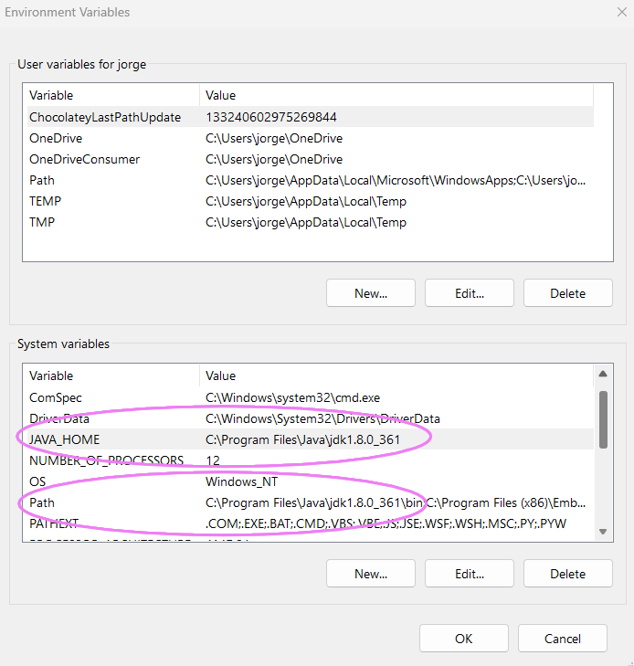
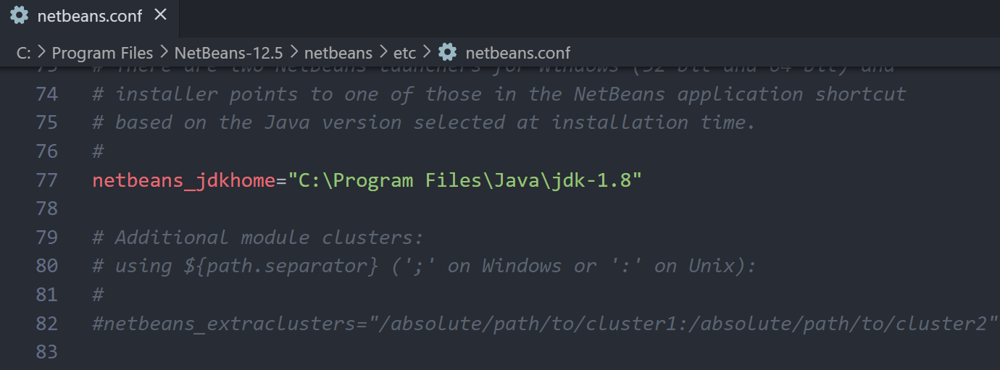
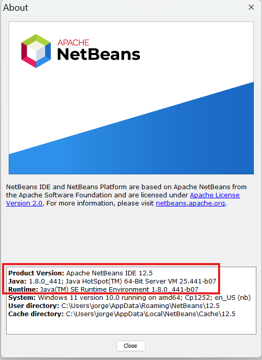
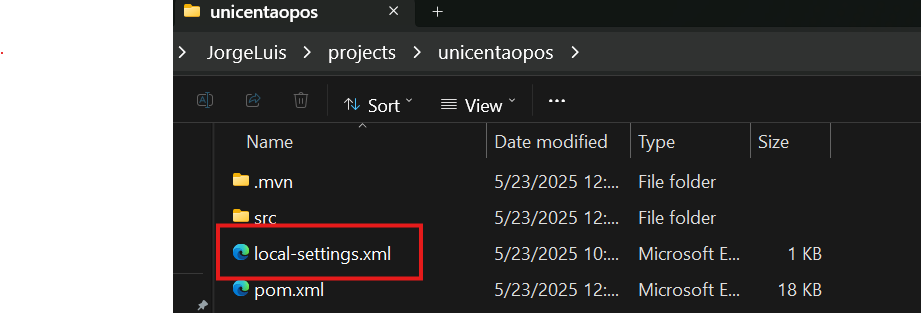
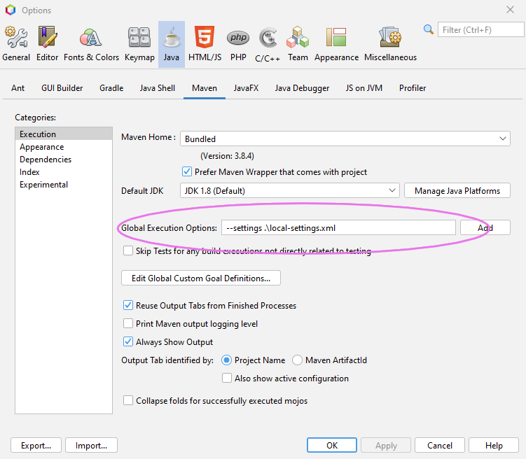
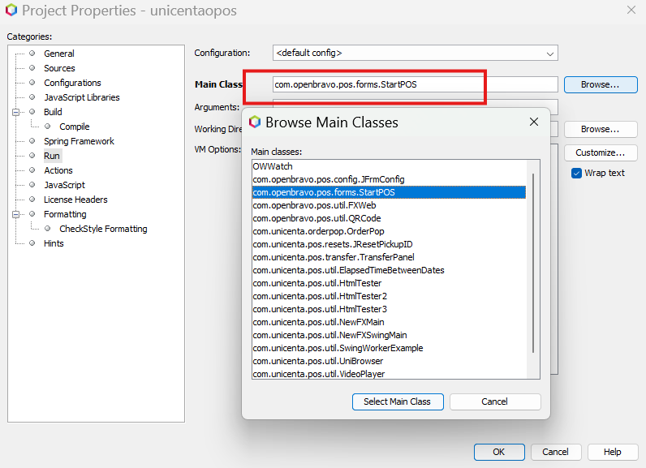

# uniCenta 4.6.4


## Software
* Java 8 (Oracle JDK)
* MySql
* Maven

## Install software and configure (Windows)
* Install Oracle JDK 8
* Install chocolatey https://community.chocolatey.org/
* Run powershell as Administrator, and then install maven 
```
choco install maven
```

## Important set path of JDK 8 (Windows)
Set JAVA_HOME and set jdk path. Not set jre path. 


## Configure MySQL
* Open file: C:\ProgramData\MySQL\MySQL Server\my.ini
* Search variable:
```
sql-mode="ONLY_FULL_GROUP_BY,STRICT_TRANS_TABLES,NO_ZERO_IN_DATE,NO_ZERO_DATE,ERROR_FOR_DIVISION_BY_ZERO,NO_ENGINE_SUBSTITUTION"
```
* Set (Remove "ONLY_FULL_GROUP_BY,"):
```
sql-mode="STRICT_TRANS_TABLES,NO_ZERO_IN_DATE,NO_ZERO_DATE,ERROR_FOR_DIVISION_BY_ZERO,NO_ENGINE_SUBSTITUTION"
```

## Create database and user
```
CREATE SCHEMA unicenta;
CREATE USER 'unicenta'@'%' IDENTIFIED BY 'u';
GRANT ALL PRIVILEGES ON unicenta.* TO 'unicenta'@'%' WITH GRANT OPTION;
```
### Update password user
```
ALTER USER 'unicenta'@'%' IDENTIFIED BY 'u';
```

## Compile and Run with Netbeans 12.5 (Windows)
* Set Oracle JDK 8

* About Netbeans

* Copy local-settings.xml file in project directory

* In menu Tools -> Options

* Set Main in properties project

* Compile and Run, and fun
## Compile (Windows)
* Get into unicenta directory 
```
cd .\unicenta\
```
* and run
```
mvn --settings .\local-settings.xml package
```
## Run (Windows)
```
java -jar .\target\unicenta.jar
```
## Format date and hour
```
yyyy-MM-dd H:mm:ss
```
